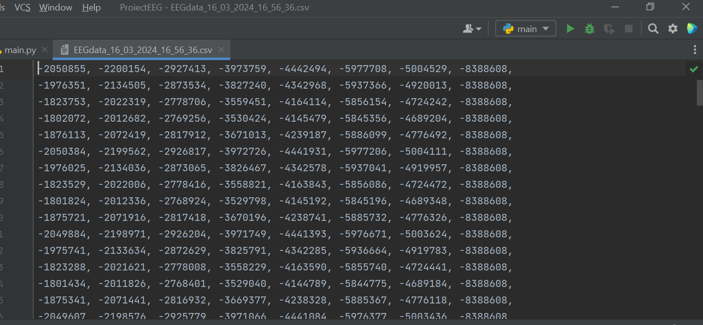
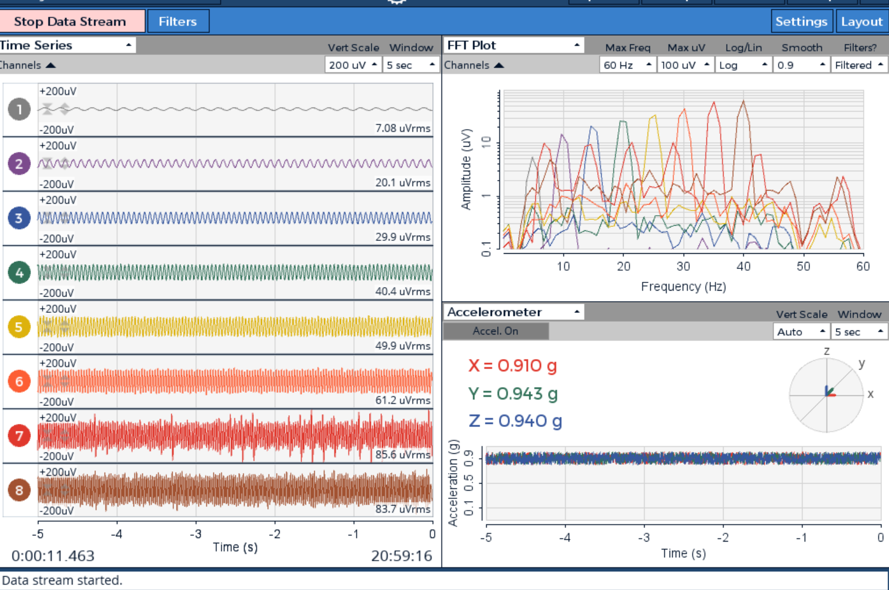

## Synapsic Brain implementation

Our hardware EEG device consists of an OpenBCI Headband Kit with 8 electrodes that were used for taking frontal cortex, temporal, and parietal measurements. We use the OpenBCI Cyton Biosensing Board to connect and communicate with our backend, through a dedicated USB dongle.

The OpenBCI GUI allows us to record, visualize and analyze real-time brain activity as participants engaged in various mental challenges and stimuli, including math questions and different noises.

Data was then saved and encrypted using a Python script, providing a unique method for participants to claim ownership of their neurological data, which then can choose to upload on Synapsic.
